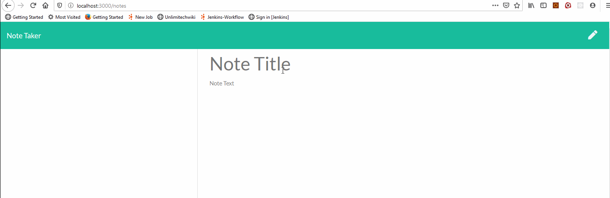

# noteTaker

## Table of Contents

- [Description](#Description)
- [Installation](#Installation)
- [Usage](#Usage)
- [Credits](#Credits)
- [License](#License)
- [Contributing](#Contributing)
- [Tests](#Tests)
- [Questions](#Questions)

## Description

A web based utility for keeping notes and reminder for important tasks. The notes are persisted in a file on the server. User can create or delete notes.

## Installation

- Install node if you haven't already: https://nodejs.org/en/download/
- run <code>npm install</code>
- run <code>node ./server.js</code>

## Usage

- Run <code>node ./server.js</code>.
- Open your browser and browse to the url http://localhost:3000/
  

## Credits

sandyboon(https://github.com/sandyboon)

## License

Licensed under the MIT license.

## Contributing

Contribution to this project is not permitted at this moment.

## Tests

There are no tests at the moment.

## Questions

Please email me your questions at sandy.boon@gmail.com. I will get back to you as soon as possible. Thank you!
